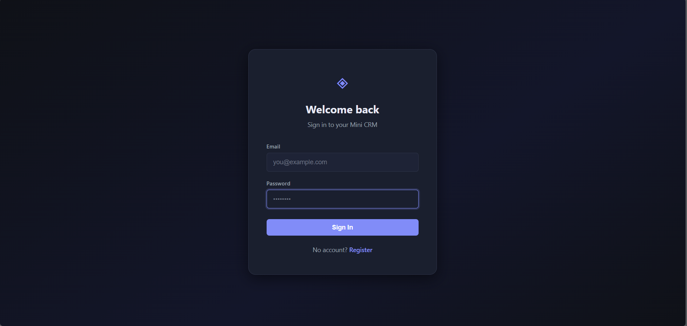
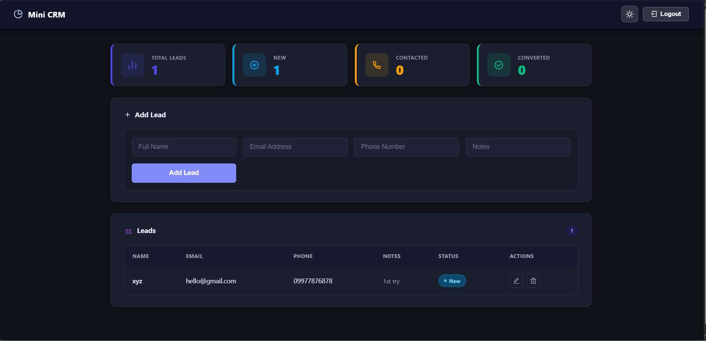

# FUTURE FS Task 2: Mini CRM (MERN)

## 🌐 Live Demo
🚀 Mini CRM App: https://future-fs-02-xi-cyan.vercel.app/

---

## 📌 Overview
A full-stack Mini CRM application built using the MERN stack. It allows users to manage client leads, track their status, and view basic analytics through a simple dashboard.

This project demonstrates full-stack development, API integration, authentication, and deployment.

---

## 🚀 Features

### 🔐 Authentication
- User registration and login (JWT-based)
- Protected routes

### 📊 Dashboard
- Total leads count
- Lead status tracking (New / Contacted / Converted)

### 🧾 Lead Management
- Add new leads
- View all leads
- Update lead status
- Delete leads

### 🎨 UI/UX
- Clean and responsive interface
- Dark / Light mode support

---

## 🛠️ Tech Stack

Frontend:
- React.js
- Axios
- CSS

Backend:
- Node.js
- Express.js

Database:
- MongoDB Atlas

Deployment:
- Frontend: Vercel
- Backend: Render

---

## 📁 Project Structure

client/   - React frontend  
server/   - Node.js backend  

---

## ⚙️ Setup Instructions

### Clone
git clone https://github.com/Mr-Zenn/FUTURE_FS_02.git  
cd FUTURE_FS_02  

### Backend
cd server  
npm install  

Create `.env` file:
PORT=5000  
MONGO_URI=your_mongodb_connection_string  
JWT_SECRET=your_secret_key  

npm start  

### Frontend
cd client  
npm install  
npm run dev  

---

## 🌐 API Endpoints

Auth:
- POST /api/auth/register  
- POST /api/auth/login  

Leads:
- GET /api/leads  
- POST /api/leads  
- PUT /api/leads/:id  
- DELETE /api/leads/:id  

Stats:
- GET /api/leads/stats  

---

## 📸 Screenshots

### Login

### Dashboard

---

## 📌 Internship Details
Track Code: FS  
Task Number: 02  
Repository Name: FUTURE_FS_02  

---

## 👤 Author
Jay Prakash
